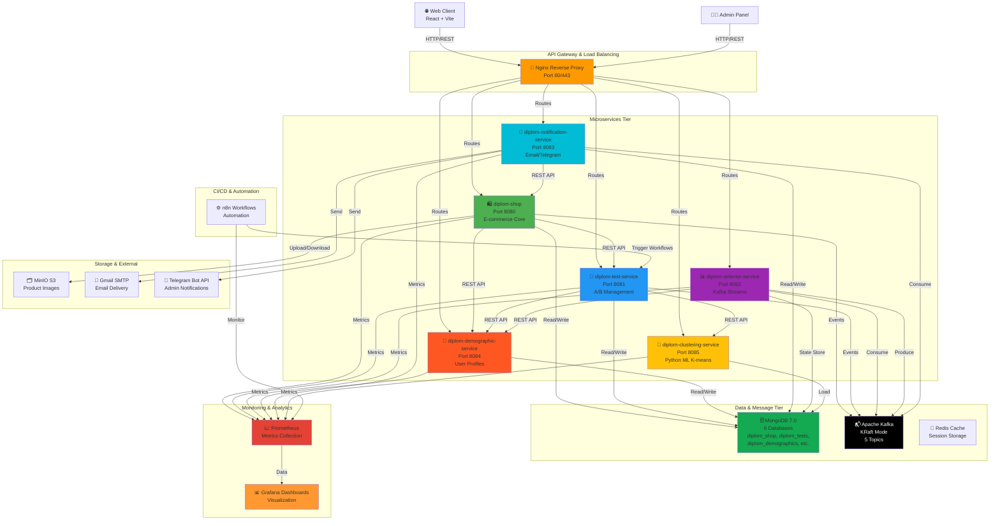
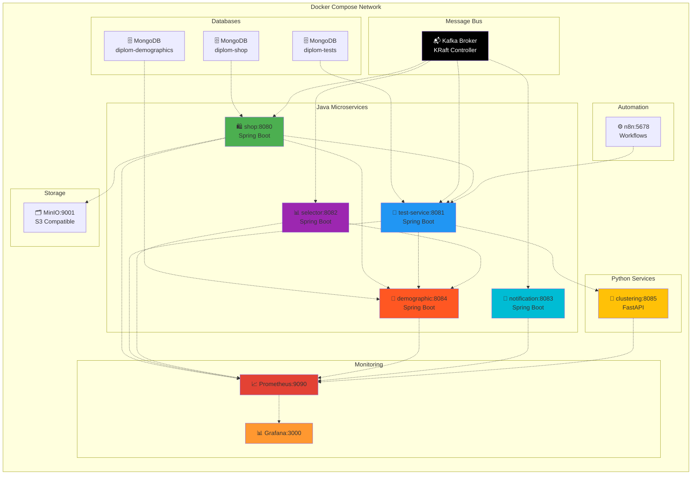
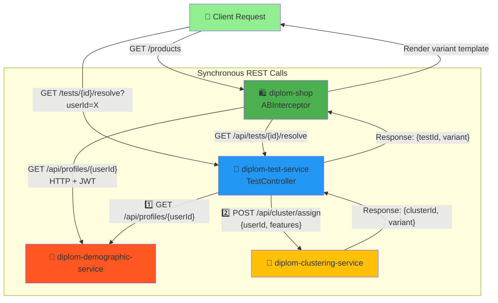
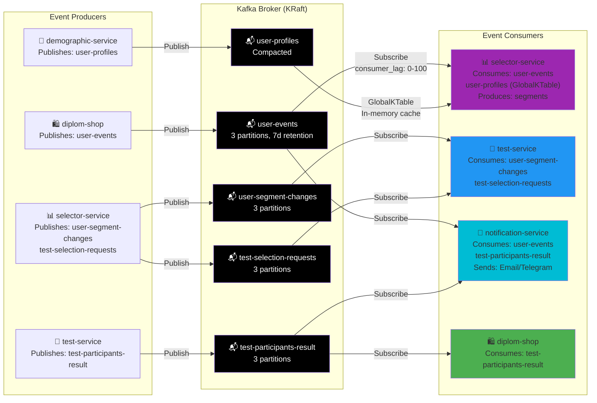
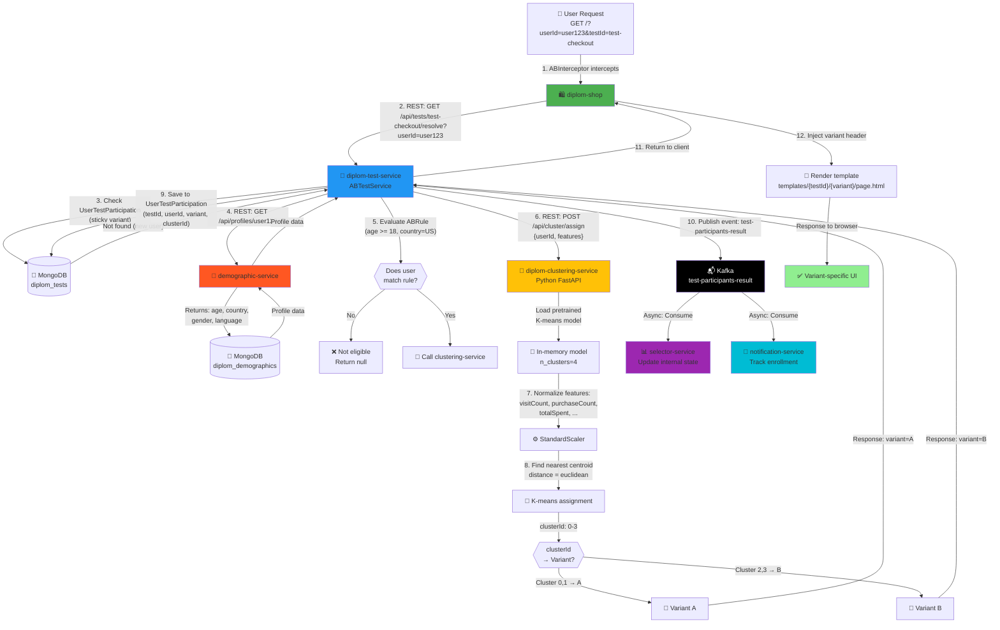
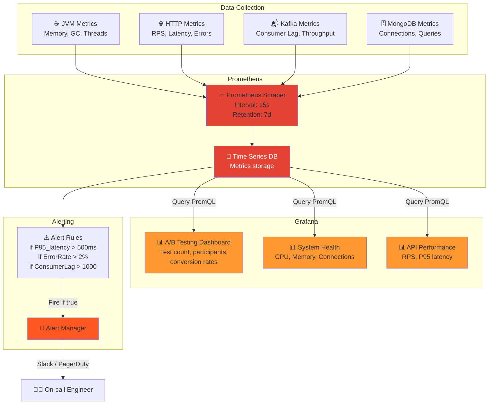

# DiplomShop Architecture Diagrams

## 1. Общая архитектура системы (High-Level)



---

## 2. Docker Compose структура



---

## 3. Взаимодействие микросервисов (Sync REST)



---

## 4. Асинхронная обработка через Kafka



---

## 5. Полный Data Flow: От запроса до A/B варианта



---

## 6. REST API маршруты и Kafka топики

```mermaid
graph LR
    subgraph "REST API Endpoints"
        GET1["GET /api/products"]
        GET2["GET /api/products/{id}"]
        POST1["POST /api/tests"]
        GET3["GET /api/tests/{id}/resolve"]
        POST2["POST /api/cart"]
        GET4["GET /api/profiles/{userId}"]
        POST3["POST /api/cluster/assign"]
        POST4["POST /api/notifications/telegram"]
    end
    
    subgraph "Kafka Topics (Async)"
        K1["📬 user-events"]
        K2["📬 user-profiles"]
        K3["📬 user-segment-changes"]
        K4["📬 test-selection-requests"]
        K5["📬 test-participants-result"]
    end
    
    subgraph "Services"
        Shop["🛍️ shop"]
        Test["🧪 test-service"]
        Selector["📊 selector"]
        Demographic["👤 demographic"]
        Notification["📧 notification"]
        Clustering["🤖 clustering"]
    end
    
    GET1 --> Shop
    GET2 --> Shop
    POST2 --> Shop
    
    POST1 --> Test
    GET3 --> Test
    
    GET4 --> Demographic
    
    POST3 --> Clustering
    
    POST4 --> Notification
    
    Shop -.->|"Produces"| K1
    Demographic -.->|"Produces"| K2
    Selector -.->|"Produces"| K3
    Selector -.->|"Produces"| K4
    Test -.->|"Produces"| K5
    
    K1 -.->|"Consumes"| Selector
    K1 -.->|"Consumes"| Notification
    K2 -.->|"GlobalKTable"| Selector
    K3 -.->|"Consumes"| Test
    K4 -.->|"Consumes"| Test
    K5 -.->|"Consumes"| Notification
    K5 -.->|"Consumes"| Shop
    
    style K1 fill:#000000,color:#fff
    style K2 fill:#000000,color:#fff
    style K3 fill:#000000,color:#fff
    style K4 fill:#000000,color:#fff
    style K5 fill:#000000,color:#fff
```



---

## 7. Процесс завершения A/B теста и архивирования

```mermaid
graph TD
    Test["🧪 A/B Test ACTIVE<br/>expiresAt = now + 1h"]
    
    Timer["⏱️ Scheduler runs<br/>every 60 seconds"]
    
    Timer -->|"Check: now >= expiresAt?"| Check{{"Is test<br/>expired?"}}
    
    Check -->|"No"| Wait["⏳ Wait next cycle"]
    Check -->|"Yes"| Aggregate["📊 Aggregate metrics"]
    
    Aggregate -->|"Count participants:<br/>variant_a.count<br/>variant_b.count<br/>conversion_a<br/>conversion_b"| Calc["🧮 Calculate stats"]
    
    Calc -->|"Create TestArchiveEntity"| Archive["📁 Archive to test_archives<br/>{testId, name, status,<br/>duration, variant_a, variant_b,<br/>completedAt}"](("💾 MongoDB"))
    
    Archive -->|"Notify admin"| Telegram["💬 TelegramService<br/>notifyTestCompletion"]
    
    Telegram -->|"✅ Test 'Checkout Page' expired.<br/>Variant A: 245 users, 32 conversions (13%)<br/>Variant B: 255 users, 48 conversions (19%)"| TelegramAPI["🔔 Telegram Bot API"]
    
    Archive -->|"Clear participants"| Clear["🗑️ Delete from<br/>UserTestParticipation<br/>where testId=X"]
    
    Clear -->|"Set status=COMPLETED"| Complete["✅ Update ABTest<br/>status=COMPLETED"]
    
    Complete -->|"Publish event"| Kafka["📬 Kafka:<br/>test-completed"]
    
    Kafka -->|"Consume"| Notification["📧 notification-service"]
    
    Notification -->|"Send notification<br/>Email to owner"| Email["📨 Gmail SMTP"]
    
    Email -->|"✉️ Your test results"| Owner["👨‍💼 Test Owner"]
    
    style Test fill:#2196F3
    style Telegram fill:#00BCD4
    style Archive fill:#FF9800
    style Complete fill:#4CAF50
    style Owner fill:#90EE90
```

---

## 8. K-means кластеризация flow

```mermaid
graph LR
    User["👤 User<br/>userId=user123"]
    
    User -->|"POST /api/cluster/assign<br/>{userId, features: {...}}"| API["🔌 FastAPI<br>/api/cluster/assign"]
    
    API -->|"1. Extract 8 features"| Features["📊 Features vector<br/>visitCount7Days: 5<br/>purchaseCount: 2<br/>totalSpent: 150.5<br/>cartAddCount: 8<br/>productViewCount: 20<br/>cartAbandoned: 0<br/>daysSinceLastEvent: 2.5<br/>hoursSinceLastCart: 6.0"]
    
    Features -->|"2. Normalize"| Normalize["⚙️ StandardScaler<br/>mean=0, std=1"]
    
    Normalize -->|"3. Load model from disk<br/>or Redis cache"| Model["🧠 Pre-trained K-means<br/>n_clusters=4<br/>centroids loaded"]
    
    Model -->|"4. Compute distances<br/>to 4 centroids"| Distance["📏 Euclidean distance<br/>d_0 = 0.45<br/>d_1 = 0.82<br/>d_2 = 1.20<br/>d_3 = 2.10"]
    
    Distance -->|"5. Find min distance"| Assign["🎯 Assign to cluster 0<br/>(nearest centroid)"]
    
    Assign -->|"6. Map cluster → variant"| Mapping{{"Cluster 0,1<br/>→ Variant A<br/>---<br/>Cluster 2,3<br/>→ Variant B"}}
    
    Mapping -->|"clusterId=0"| VariantA["📌 Variant: A"]
    
    VariantA -->|"Response:<br/>{<br/>  clusterId: 0,<br/>  variant: 'A',<br/>  distance: 0.45<br/>}"| Response["✅ Return to test-service"]
    
    style API fill:#FFC107
    style Features fill:#FF9800
    style Model fill:#673AB7
    style Distance fill:#2196F3
    style VariantA fill:#4CAF50
    style Response fill:#90EE90
```



---

## 9. Мониторинг и Alerting



---

## 10. Deployment Pipeline (Docker Compose → Kubernetes)

```mermaid
graph LR
    Dev["💻 Developer<br/>git push"]
    
    Dev --> GitHub["🐙 GitHub Repo"]
    
    GitHub -->|"Webhook"| CI["🔧 CI Pipeline<br/>Maven: mvn clean package"]
    
    CI -->|"Build JAR"| Docker["🐳 Docker Build<br/>Multi-stage build<br/>maven:3.9 → temurin:21"]
    
    Docker -->|"Push image"| Registry["📦 Docker Registry<br/>ghcr.io/repo/service:latest"]
    
    Registry -->|"docker pull"| DevDeploy["📦 Local Dev<br/>docker-compose up"]
    
    Registry -->|"docker pull"| K8s["☸️ Kubernetes Cluster<br/>Helm charts"]
    
    DevDeploy -->|"Integration tests"| Tests["✅ Test Suite<br/>Testcontainers"]
    
    Tests -->|"Pass/Fail"| Result{{"Status?"}}
    
    Result -->|"Pass"| Prod["🚀 Production Deploy<br/>Rolling update<br/>Health checks"]
    
    Prod -->|"Traffic"| LB["⚖️ Load Balancer<br/>Auto-scale based on metrics"]
    
    style CI fill:#4CAF50
    style Docker fill:#2196F3
    style Registry fill:#FF9800
    style K8s fill:#673AB7
    style Prod fill:#4CAF50
```


