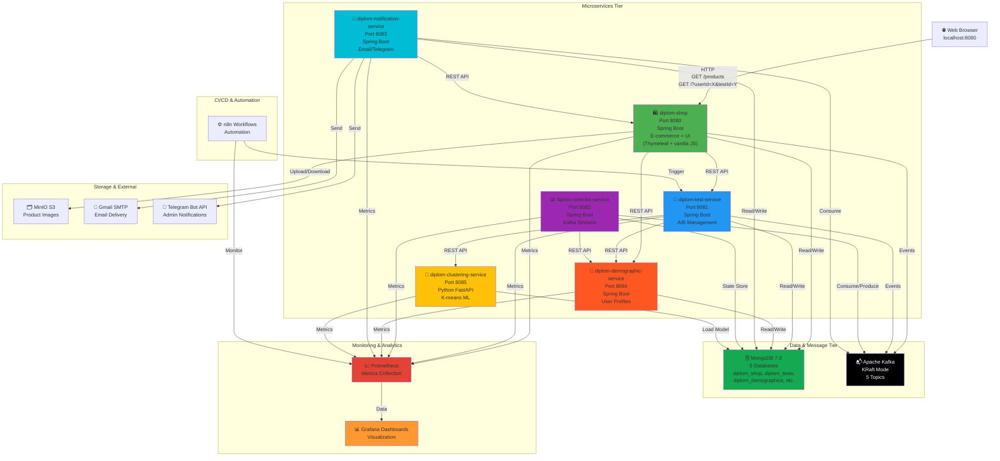
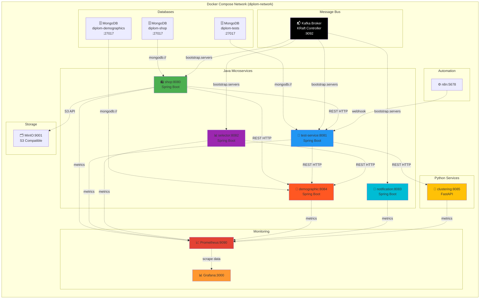
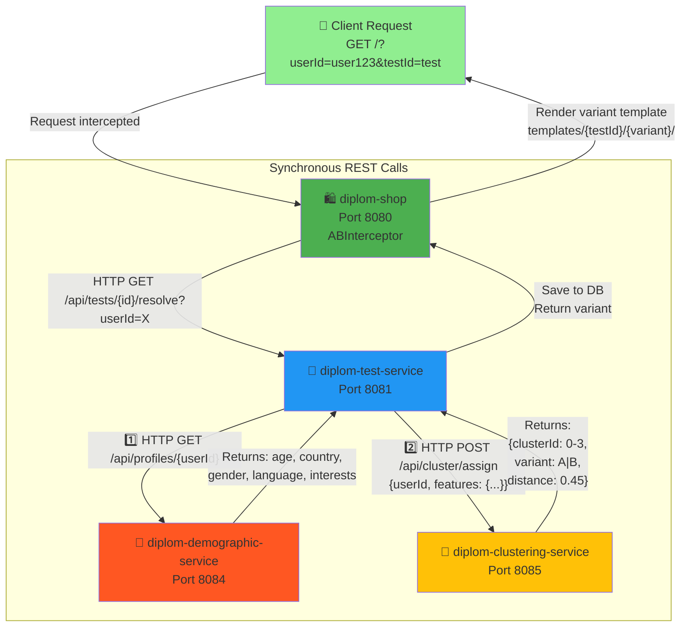
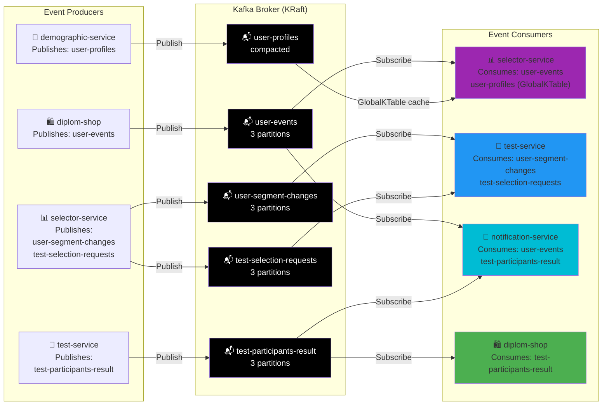
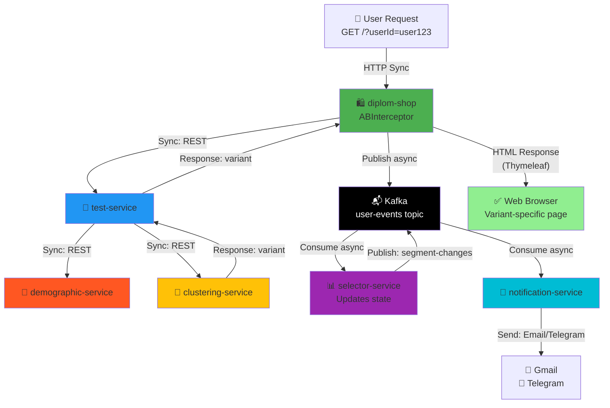
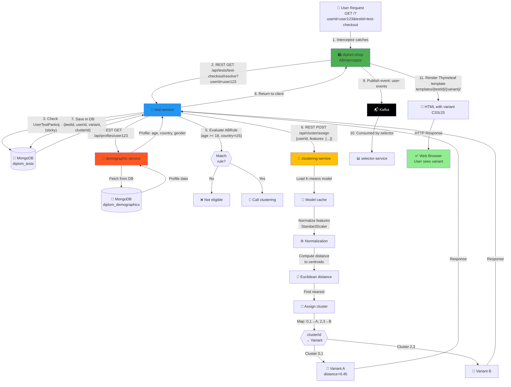
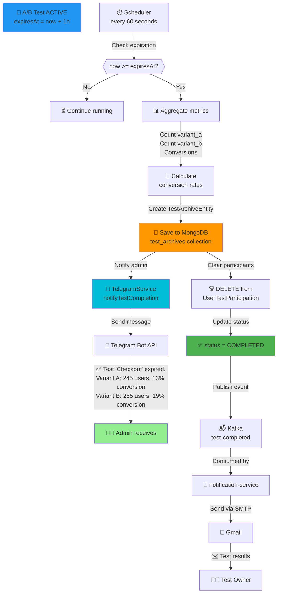
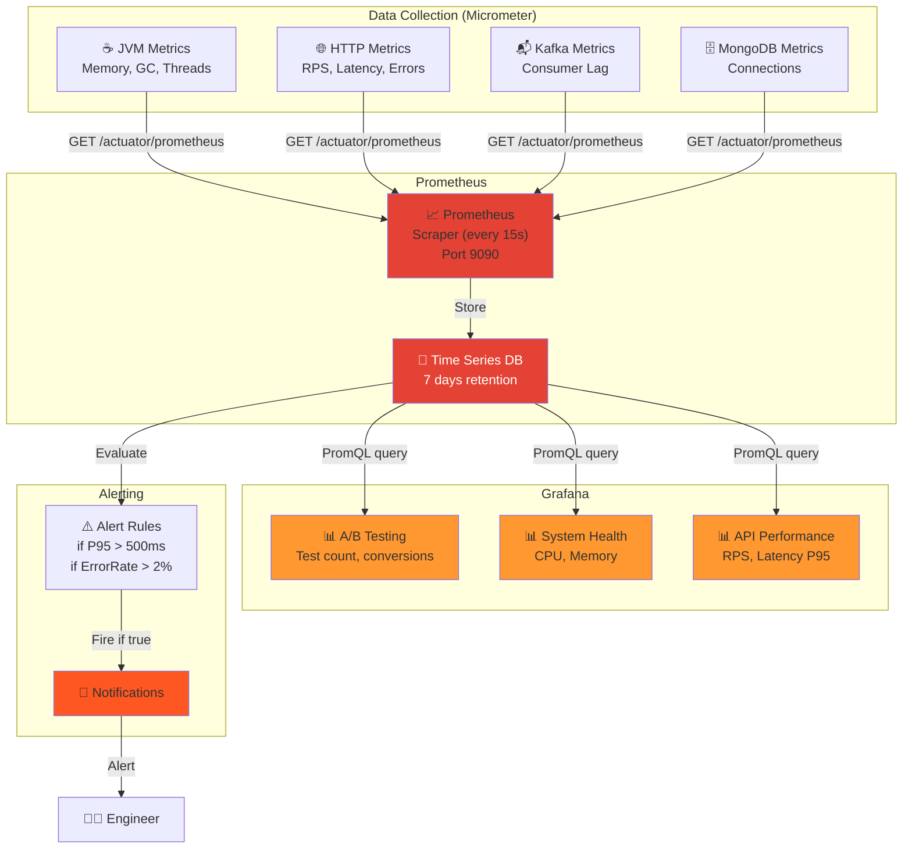

# DiplomShop Architecture Diagrams (Corrected)

## 1. Общая архитектура системы (High-Level)

---

## 2. Docker Compose структура

---

## 3. Взаимодействие микросервисов (Sync REST)

---

## 4. Асинхронная обработка через Kafka

---

## 5. REST + Kafka Integration Flow

---

## 6. Полный Data Flow: От запроса до A/B варианта

---

## 7. Процесс завершения A/B теста

---

## 8. K-means кластеризация flow

```mermaid
graph LR
    User["👤 User<br/>userId=user123"]
    
    User -->|"POST /api/cluster/assign<br/>HTTP JSON"| API["🔌 diplom-clustering-service<br/>FastAPI"]
    
    API -->|"Request body"| Features["📊 8 Features vector<br/>visitCount7Days: 5<br/>purchaseCount: 2<br/>totalSpent: 150.5<br/>cartAddCount: 8<br/>productViewCount: 20<br/>cartAbandoned: 0<br/>daysSinceLastEvent: 2.5<br/>hoursSinceLastCart: 6.0"]
    
    Features -->|"Apply StandardScaler<br/>mean=0, std=1"| Normalize["⚙️ Normalization<br/>[0.25, -0.5, 0.8, ...]"]
    
    Normalize -->|"Load from disk"| Model["🧠 K-means Model<br/>n_clusters=4<br/>4 centroids"]
    
    Model -->|"Compute Euclidean<br/>distance to each"| Distance["📏 Distances<br/>d_0=0.45<br/>d_1=0.82<br/>d_2=1.20<br/>d_3=2.10"]
    
    Distance -->|"min(distances)"| Assign["🎯 min_distance=0.45<br/>cluster=0"]
    
    Assign -->|"Map cluster"| Mapping["📌 Strategy:<br/>0,1 → A<br/>2,3 → B<br/>Result: variant=A"]
    
    Mapping -->|"Return JSON"| Response["✅ HTTP Response<br/>{clusterId: 0,<br/>variant: 'A',<br/>distance: 0.45}"]
    
    Response -->|"Back to test-service"| Test["🧪 diplom-test-service"]
    
    style API fill:#FFC107
    style Features fill:#FF9800
    style Model fill:#673AB7
    style Distance fill:#2196F3
    style Mapping fill:#4CAF50
    style Response fill:#90EE90
```

---

## 9. Мониторинг и Alerting

---

## 10. Deployment Pipeline (docker-compose)

```mermaid
graph LR
    Dev["💻 Developer<br/>git push"]
    
    Dev --> GitHub["🐙 GitHub Repo"]
    
    GitHub -->|"Webhook trigger"| Build["🔧 GitHub Actions<br/>Maven: mvn clean package"]
    
    Build -->|"mvn package"| JAR["📦 JAR artifacts"]
    
    JAR -->|"docker build"| Docker["🐳 Docker Build<br/>Multi-stage<br/>maven → temurin:21"]
    
    Docker -->|"Build image"| LocalTest["📦 Image ready<br/>ghcr.io/repo/service:latest"]
    
    LocalTest -->|"docker-compose pull"| DevEnv["🐳 docker-compose up -d<br/>Local Development"]
    
    DevEnv -->|"Start containers"| Services["6 Microservices<br/>+ MongoDB<br/>+ Kafka<br/>+ Grafana"]
    
    Services -->|"Integration tests"| Tests["✅ Testcontainers<br/>Test Suite"]
    
    Tests -->|"Pass"| Ready["✅ Ready for use"]
    
    style Build fill:#4CAF50
    style Docker fill:#2196F3
    style LocalTest fill:#FF9800
    style DevEnv fill:#673AB7
    style Ready fill:#4CAF50
```

---

## Компоненты (6 микросервисов)

| Сервис | Порт | Язык | Ответственность |
|--------|------|------|-----------------|
| diplom-shop | 8080 | Java | E-commerce, A/B маршрутизация, UI |
| diplom-test-service | 8081 | Java | Управление A/B тестами, вариант-выбор |
| diplom-selector-service | 8082 | Java | Kafka Streams, сегментация пользователей |
| diplom-demographic-service | 8084 | Java | Хранилище профилей пользователей |
| diplom-notification-service | 8083 | Java | Email, Telegram уведомления |
| diplom-clustering-service | 8085 | Python | K-means ML, кластеризация |

---

## Kafka топики (5)

| Топик | Партиции | Использование |
|-------|----------|---|
| user-events | 3 | События пользователей (page view, purchase, add to cart) |
| user-profiles | 1 (compact) | Демографические данные (GlobalKTable) |
| user-segment-changes | 3 | События изменения сегмента пользователя |
| test-selection-requests | 3 | Запросы на отбор пользователя в тест |
| test-participants-result | 3 | Результат назначения пользователя варианту |

---

## Базы данных MongoDB (3)

| База | Коллекции | Назначение |
|------|-----------|-----------|
| diplom_shop | users, products, orders, user_test_participation | E-commerce данные |
| diplom_tests | ab_tests, test_archives, ab_rules | A/B тесты и правила |
| diplom_demographics | user_demographics | Демографические профили |
